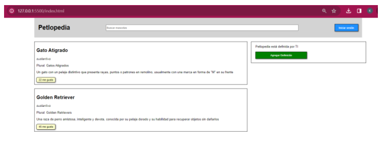
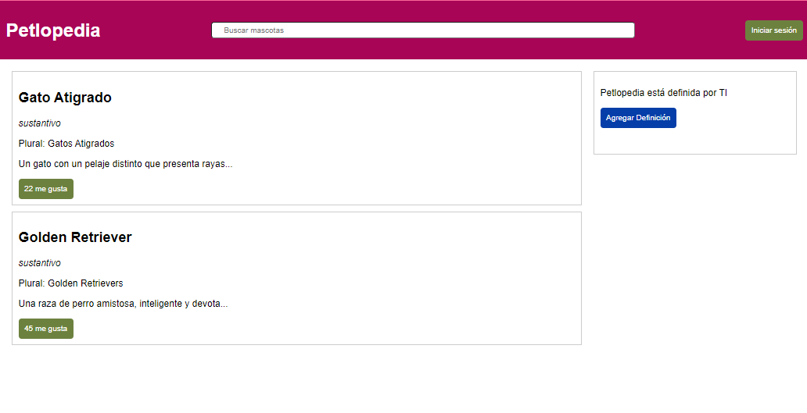

# Ejercicio – Evento OnClick

##Descripción

¿Sabes qué pasa cuando haces clic en un botón en una página web? ¡Bueno, eso es precisamente lo que vamos a aprender a hacer! Vamos a usar algo llamado «evento onclick». Básicamente, nos permite hacer que ocurra algo entretenido cuando hacemos clic en algo en nuestra página.
Entonces, ¿cómo lo haremos? Primero, vamos a practicar cómo usar este evento. Luego, vamos a mezclar todos esos trucos que aprendimos sobre HTML, CSS y JavaScript. La idea es recrear el diseño que estamos viendo aquí. Pero aquí está el truco: antes de ponernos manos a la obra con la parte de JavaScript, vamos a centrarnos en hacer que el HTML y el CSS se vean y funcionen perfectamente. Una vez que hayamos logrado eso, ¡agregaremos la funcionalidad con JavaScript!
Vamos a pasar por estos pasos de manera tranquila y sin estrés para asegurarnos de que nuestra página web se vea y funcione de manera increíble. ¡Es como armar un rompecabezas pero con código!

## Imagen de referencia

## Resultado

