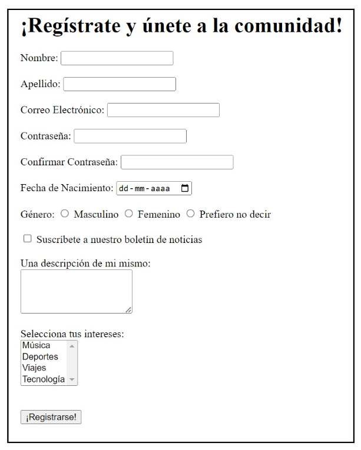
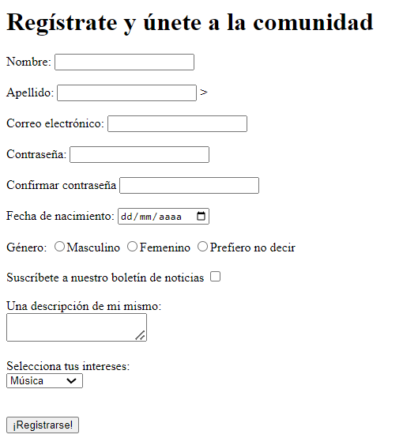

# Ejercicio – Hagamos un Formulario de Registro

Descripción

Vamos a hablar de algo esencial en la mayoría de los sitios web: ¡los formularios de registro! Ya sabes, esos cuadros donde llenas tus datos para unirte a algo, como un correo electrónico nuevo, una red social, o incluso este curso.
¿Te imaginas cuántos formularios llenarás en los próximos meses? Un montón. Así que es hora de que nos pongamos cómodos creando algunos. Ahora nos vamos a centrar en hacerlo con HTML, sin preocuparnos por cómo se ve.

## Imagen de referencia

## Resultado

