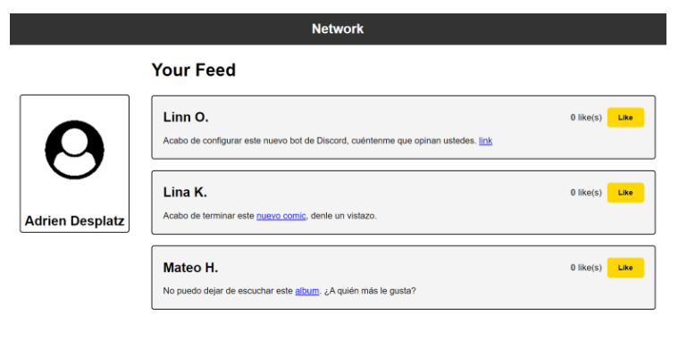
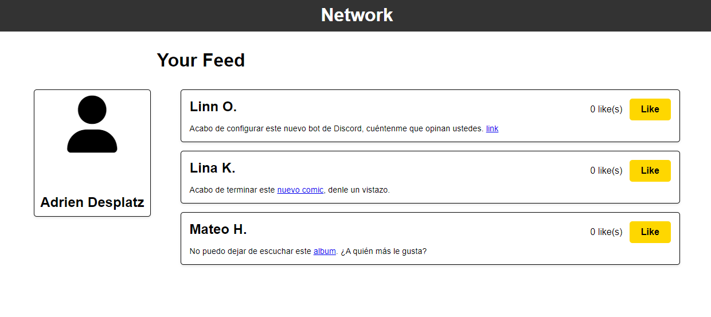

# Ejercicio – Me Gusta

## Descripción

Hoy vamos a hablar sobre algo que a todos nos encanta: ¡los «Me gusta»! Y lo mejor es que vamos a aprender a hacer que ese botón de «Me gusta» funcione en nuestra página web.
El objetivo de este ejercicio es seguir practicando con el evento onclick y aprender a utilizar querySelector para seleccionar los elementos que queremos cambiar.
Parte I:
Vamos a recrear un diseño que incluye un botón de «Me gusta» y hacer que funcione para aumentar la cantidad de «Me gusta». Pero esta vez, vamos a hacerlo de una manera un poco diferente. Como vamos a cambiar el número en un elemento diferente al que le damos clic, no podremos usar this esta vez, por lo que tendrás que utilizar el querySelector para seleccionar los elementos que queremos cambiar.
Así que prepárense para darle a ese botón de «Me gusta» todo el amor que se merece.

Parte II:
Esta vez, vamos a crear un sitio web con tres publicaciones diferentes, ¡y cada una tendrá su propio botón de «Me gusta»! Pero aquí está el truco: queremos asegurarnos de que cada botón de «Me gusta» solo aumente los «Me gusta» de esa publicación en particular.
Podríamos hacer un seguimiento de los «Me gusta» de cada publicación usando variables separadas. Así que, prepárense para darle amor a esas publicaciones y vamos a hacer que esos botones de «Me gusta» funcionen como un encanto. ¡Vamos!

## Imagen de referencia

## Resultado

