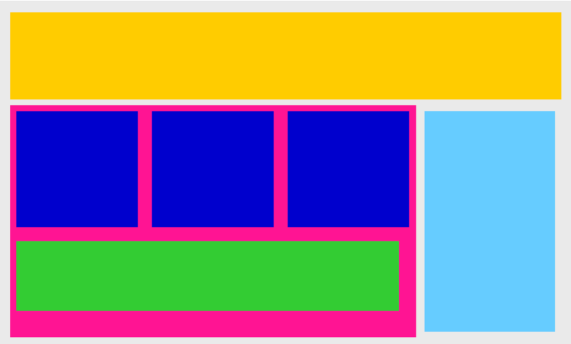
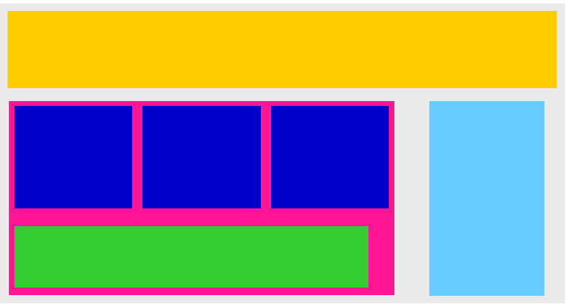

# Ejercicio – Nuevos Bloques

## Descripción

Vamos a intentar replicar la imagen que ves abajo ajustando todo lo que hemos aprendido de CSS hasta ahora. Utilizaremos márgenes y rellenos para controlar los espacios entre las divisiones y usaremos la propiedad de display para colocar cada bloque en su posición correcta. Es posible que necesitemos agregar algunas propiedades CSS más para lograrlo. ¡Manos a la obra! Si tienes alguna pregunta, ¡no dudes en hacerla a tu profesor, tutor o compañeras!

## Imagen de referencia

## Resultado

