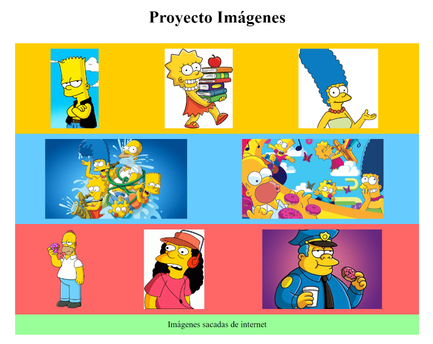
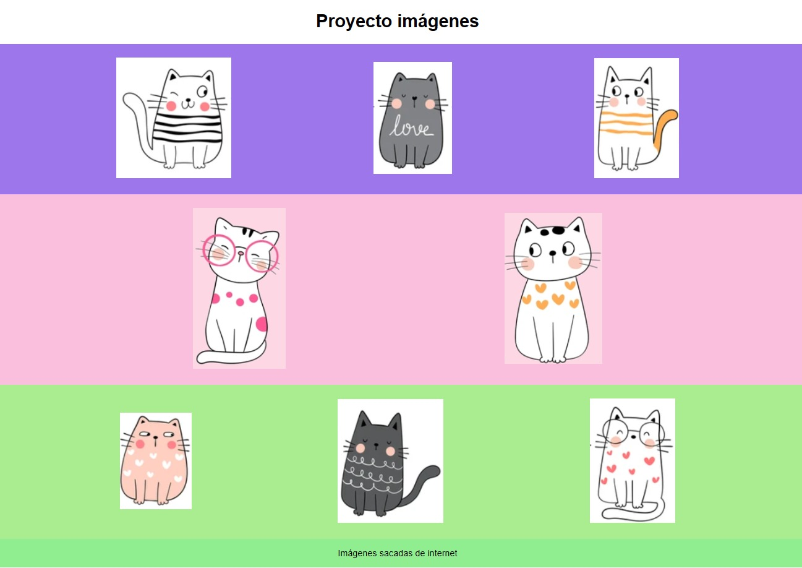

# Ejercicio – Diseñando con Imágenes

## Descripción

Vamos a meternos en el emocionante mundo de GitHub y a practicar un poco de diseño web. Nuestro objetivo es crear algo genial usando algunas herramientas como padding, border y margin. Además, vamos a utilizar Flexbox, que es como la varita mágica del diseño web.
Para empezar, elige tus colores favoritos y las imágenes que más te gusten. Puedes usar Octodex en GitHub.
Luego, vamos a recrear el diseño que ves aquí, asegurándonos de que todas las imágenes tengan el mismo tamaño y estén perfectamente alineadas.

## Imagen de referencia

## Resultado

